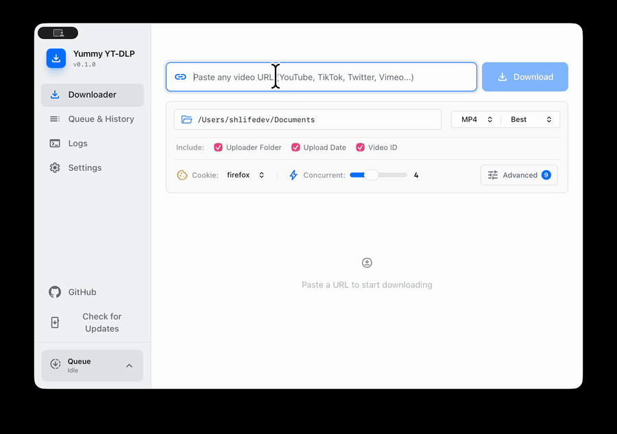

# yt-dlp Modern GUI


Современное кроссплатформенное настольное приложение для загрузки видео с использованием yt-dlp.
Построено на Tauri 2.0 (Rust) и SvelteKit, предоставляя чистый и интуитивный интерфейс для управления загрузками видео.

[**English**](../README.md) | [**한국어**](README.ko.md) | [**日本語**](README.ja.md) | [**中文(简体)**](README.zh-CN.md) | [**中文(繁體)**](README.zh-TW.md) | [**Español**](README.es.md) | [**Français**](README.fr.md) | [**Deutsch**](README.de.md) | [**Português**](README.pt-BR.md) | **Русский** | [**Tiếng Việt**](README.vi.md)

## Видео

<p align="center">
  
</p>

## Возможности

- Загрузка видео и плейлистов с выбором формата и качества
- Кроссплатформенная поддержка (Windows, macOS, Linux)
- Очередь одновременных загрузок с отменой и повтором
- История загрузок с поиском
- Чистый настольный интерфейс для yt-dlp

<details>
<summary>Расширенные возможности</summary>

- Автоматическое обнаружение зависимостей yt-dlp и FFmpeg с руководством по установке
- Настройка шаблона имени файла (простой и продвинутый режимы)
- Поддержка файлов Cookie для аутентифицированного контента
- Обнаружение дублирующихся загрузок
- Многоязычная поддержка
- 4 цветовые темы (Dark, Violet, Red, Light)

</details>

> **💡 Совет:** Приложение автоматически настраивает yt-dlp, FFmpeg и Deno при первом запуске (поставляются вместе с приложением и загружаются/обновляются по мере необходимости). Автоматически управляемая сборка yt-dlp самораспаковывается при каждом запуске, поэтому её первый запуск может быть медленным. Для **значительно более быстрого** получения метаданных и загрузок рекомендуется предварительно установить их через системный менеджер пакетов — [Homebrew](https://brew.sh/) на macOS (`brew install yt-dlp ffmpeg`), [winget](https://learn.microsoft.com/windows/package-manager/winget/) на Windows (`winget install yt-dlp.yt-dlp ffmpeg`), или `apt`/`pacman` на Linux. По умолчанию приложение обнаруживает и приоритетно использует версии, установленные в системном PATH.

## Сборка из исходного кода

### Предварительные требования

- [Rust](https://www.rust-lang.org/tools/install) (последняя stable версия)
- [Node.js](https://nodejs.org/) (v18+)
- [Bun](https://bun.sh/) (менеджер пакетов)
- Платформо-зависимые зависимости для [Tauri 2.0](https://v2.tauri.app/start/prerequisites/)

### Шаги

```bash
# Клонировать репозиторий
git clone https://github.com/shlifedev/yt-dlp-modern-gui.git
cd yt-dlp-modern-gui

# Установить зависимости фронтенда
bun install

# Запустить в режиме разработки
bun run tauri dev

# Сборка для продакшена
bun run tauri build
```

Результат продакшен-сборки находится в `src-tauri/target/release/bundle/`.

## Благодарности и лицензии сторонних компонентов

Это приложение поставляется в комплекте или загружает следующие бинарные файлы с открытым исходным кодом:

- **yt-dlp** — The Unlicense — https://github.com/yt-dlp/yt-dlp
- **FFmpeg** — GPLv3 — bundled GPL builds: https://github.com/BtbN/FFmpeg-Builds (Windows/Linux), https://github.com/vanloctech/ffmpeg-macos (macOS); source: https://ffmpeg.org
- **Deno** — MIT — https://github.com/denoland/deno

FFmpeg распространяется под лицензией GNU General Public License v3. Точная GPL-сборка, поставляемая с каждым выпуском, указана по ссылкам выше; соответствующий исходный код доступен на сайте проекта FFmpeg и у поставщиков сборок.

## Лицензия

Этот проект распространяется под лицензией [MIT License](../LICENSE).
